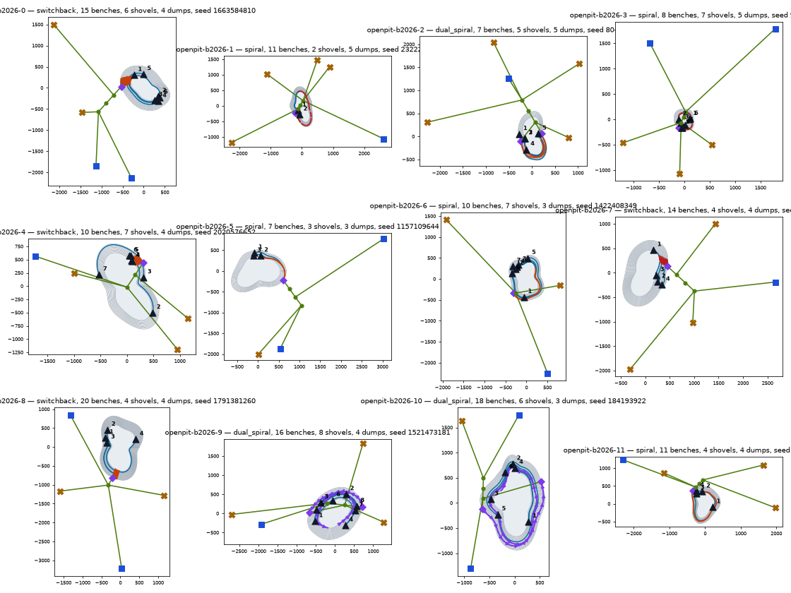

# minehaulsim

[](https://github.com/fsantibanezleal/CAOS_MINEHAUL/actions)
[](LICENSE)
[](https://github.com/fsantibanezleal/CAOS_MINEHAUL/tags)

**Deterministic discrete-event simulation of open-pit and underground mine haulage on constrained
road networks, with seeded parametric mine generators.**

No open-source package simulates mine haulage on a *real constrained road network*: existing OSS
simulators use one fixed mine layout, scalar distance matrices, no grades/rimpull and no traffic
constraints — and the tools that do this right (HAULSIM, TALPAC-3D, SimMine) are commercial and
closed. `minehaulsim` fills that gap:

- **Constrained road network, first-class.** Haul routes are a directed multigraph: one-way ramps,
  width/passing classes, junction blocking, direction zones (single-lane drifts with passing bays),
  speed-by-grade from rimpull/retarder curves — travel times come from the network, not scalars.
- **Genuinely varied mines.** Seeded parametric generators for open pits (benches, phases,
  spiral/switchback ramps, multiple faces/dumps) and underground multi-level mines (levels,
  declines, shafts, ore passes, drifts) — a different, valid mine per seed, never one shape reused.
- **Deterministic DES core.** Hand-rolled event engine (no simpy); a run is a pure function of
  `(spec, policy, seed)` — byte-identical outputs across OS/sessions. Dispatch-policy hook with
  baseline policies included.
- **Interoperable outputs.** `cyclelog/v1` CSV event logs (load/haul/dump/return), provenance JSON,
  a per-truck position trace, and topography exports for 3D viewers.
- **numpy-only core.** Visualization is an opt-in extra; the core never imports matplotlib.

## Scenario variety — the gallery

Twelve scenarios from one `generate_batch(12, seed=2026)` call, every one passing the seven
validity gates with a unique structural signature (full set + per-pit summaries in
[`gallery/`](gallery/README.md); regenerate with `python scripts/gen_gallery.py`):



## Status

`0.10.000` — the first published release: equipment + rimpull kinematics, constrained routing,
deterministic DES with per-segment traffic (emergent bunching), the full haul cycle with five
dispatch policies, a mine-planning layer (phases, depletion, slope damage, speed zones),
underground multi-level mines with LHD/ore-pass inventory coupling and three flow modes,
opt-in failure processes with a CI-enforced performance floor, the DispatchLab IO contracts,
the varied generators, the viz extra and the CLI. Per-unit history in `CHANGELOG.md`.

**Docs:** the navigable wiki starts at [`docs/README.md`](docs/README.md) — read
[`docs/what-it-is-and-isnt.md`](docs/what-it-is-and-isnt.md) before trusting any number.

## Install

```bash
pip install minehaulsim            # numpy-only core
pip install "minehaulsim[viz]"     # + matplotlib renders

# development
pip install -e ".[dev]"
pytest
```

## CLI

```bash
minehaulsim generate --seed 42 --out out/     # validated spec JSON (+ plan SVG with [viz])
minehaulsim batch --n 10 --seed 2026 --out samples/
minehaulsim run --spec out/openpit-42.minespec.json --policy minqueue --out out/
minehaulsim render --spec out/openpit-42.minespec.json --out out/
minehaulsim validate out/mhs-openpit-42-minqueue.csv
minehaulsim demo
```

## Honesty

This is a *simulation* package: equipment curves are class-representative (not OEM data), generated
mines are synthetic (structure-real at best, and always labelled), and nothing here predicts a real
operation without calibration. The docs carry a dedicated *what-it-is-and-isn't* section.

## License

Apache-2.0.
