# Scenario gallery

12 scenarios from `generate_batch(n=12, seed=2026)` — every one passes the seven
validity gates and carries a UNIQUE structural signature (ramp style, depth, roster,
network shape). Regenerate with `python scripts/gen_gallery.py`.

| # | preview | structure |
|---|---------|-----------|
| 0 | 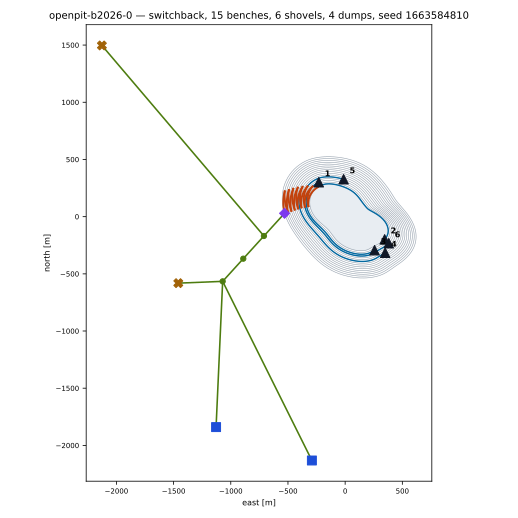 | `switchback` (2 lane), 15 benches x 15.0 m, 6 shovels, 4 dumps, 48 trucks, sig `('openpit', 'switchback', 3, 6, 4, 3, 1, 'truck_surface')` |
| 1 | 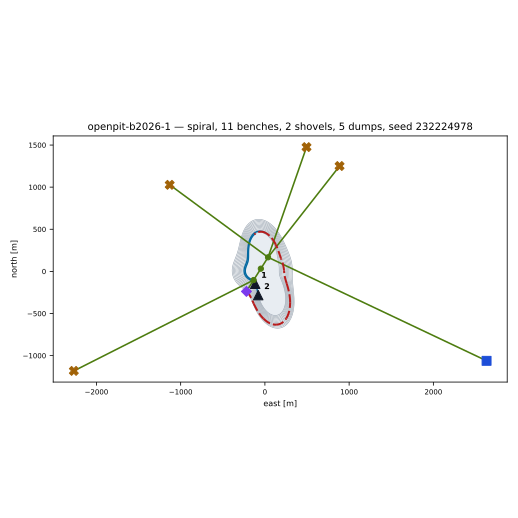 | `spiral` (1 lane), 11 benches x 12.0 m, 2 shovels, 5 dumps, 18 trucks, sig `('openpit', 'spiral', 2, 2, 5, 3, 1, 'truck_surface')` |
| 2 | 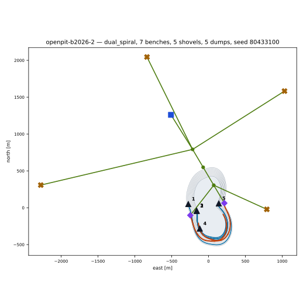 | `dual_spiral` (2 lane), 7 benches x 12.0 m, 5 shovels, 5 dumps, 27 trucks, sig `('openpit', 'dual_spiral', 1, 5, 5, 3, 1, 'truck_surface')` |
| 3 | 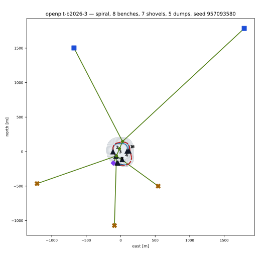 | `spiral` (1 lane), 8 benches x 10.0 m, 7 shovels, 5 dumps, 17 trucks, sig `('openpit', 'spiral', 2, 7, 5, 3, 1, 'truck_surface')` |
| 4 | 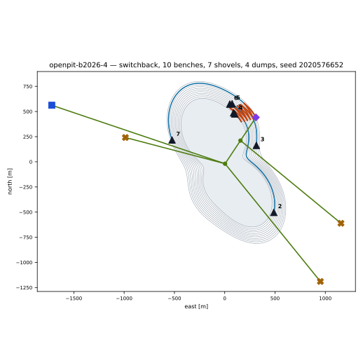 | `switchback` (2 lane), 10 benches x 15.0 m, 7 shovels, 4 dumps, 48 trucks, sig `('openpit', 'switchback', 2, 7, 4, 2, 1, 'truck_surface')` |
| 5 | 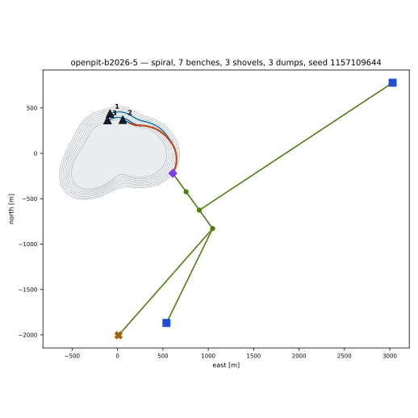 | `spiral` (2 lane), 7 benches x 10.0 m, 3 shovels, 3 dumps, 21 trucks, sig `('openpit', 'spiral', 1, 3, 3, 3, 0, 'truck_surface')` |
| 6 | 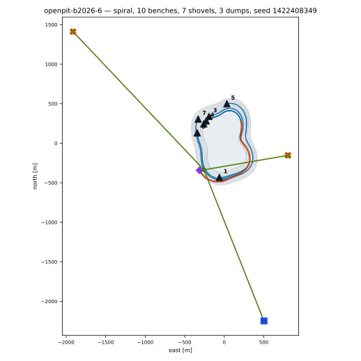 | `spiral` (2 lane), 10 benches x 12.0 m, 7 shovels, 3 dumps, 48 trucks, sig `('openpit', 'spiral', 2, 7, 3, 1, 1, 'truck_surface')` |
| 7 | 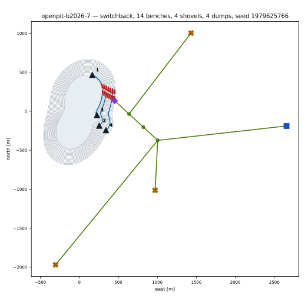 | `switchback` (1 lane), 14 benches x 12.0 m, 4 shovels, 4 dumps, 48 trucks, sig `('openpit', 'switchback', 3, 4, 4, 3, 1, 'truck_surface')` |
| 8 | 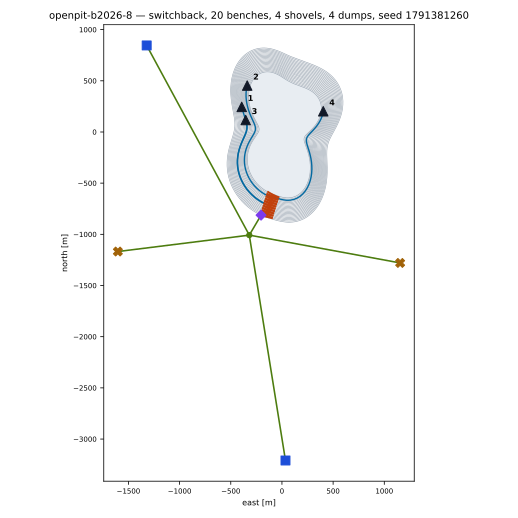 | `switchback` (2 lane), 20 benches x 10.0 m, 4 shovels, 4 dumps, 48 trucks, sig `('openpit', 'switchback', 5, 4, 4, 1, 1, 'truck_surface')` |
| 9 | 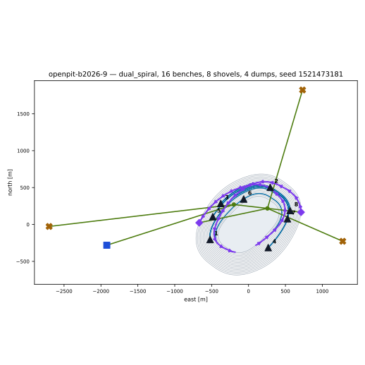 | `dual_spiral` (1 lane), 16 benches x 12.0 m, 8 shovels, 4 dumps, 48 trucks, sig `('openpit', 'dual_spiral', 4, 8, 4, 2, 2, 'truck_surface')` |
| 10 | 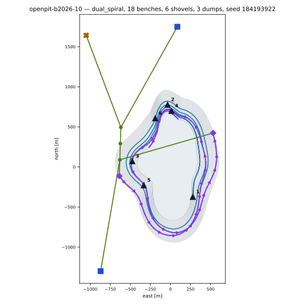 | `dual_spiral` (1 lane), 18 benches x 15.0 m, 6 shovels, 3 dumps, 48 trucks, sig `('openpit', 'dual_spiral', 4, 6, 3, 3, 2, 'truck_surface')` |
| 11 | 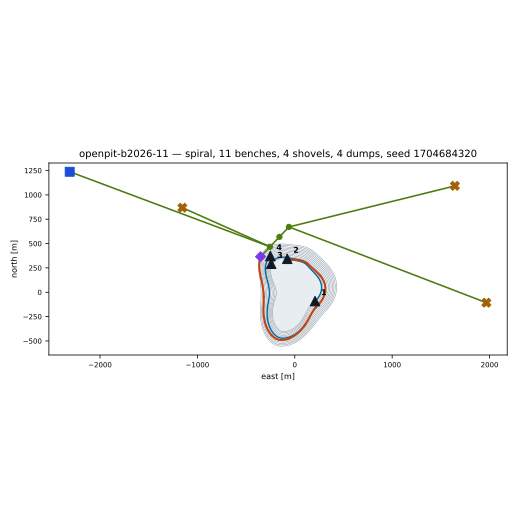 | `spiral` (2 lane), 11 benches x 15.0 m, 4 shovels, 4 dumps, 36 trucks, sig `('openpit', 'spiral', 2, 4, 4, 3, 1, 'truck_surface')` |
